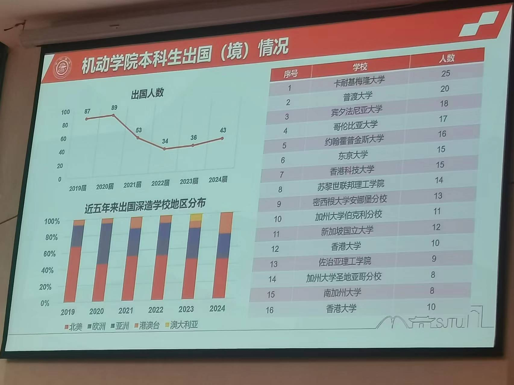

# 未来计划之留学

## 概念
留学是啥这里就不说了，大家肯定都知道的 (手动狗头:joy:)

## 优劣
（申明：这里是客观地分析国内外的优劣，并不是一味鼓吹国外，我们只是希望你能利用好这些信息来对未来进行决策。如果有条件并且之后也想留在学术圈我们非常推荐你你硕士/博士/博士后期间在国外进行积累，等学成之后回国）
* 优点：
   1. **更健全的学术环境**：国外学术环境体系相对成熟，而国内在慢慢发展但还需要提升（比如同行评议方面，这里为了本书的安全不展开）。推荐了解国内外学术环境渠道：微信公众号饶议科学，b站老司机耿进财（链接：https://space.bilibili.com/81249447?spm_id_from=333.337.0.0）。
   2. **更多的机会**：人脉上，在国外你可能会有更多的机会参加各种学术会议并且认识各种行业的大佬；行业发展上，许多站在风口的公司（比如Nvidia）都在国外，如果想之后进入业界工作你会拥有更多的connection并且也在那边方便你实习；经济基础上，国外经济环境虽然没好到哪去，但是暂时比国内舒缓，能够提供更多的就业机会
   3. **开阔自己的视野**：这个自然不必说，换一个环境大家对生活的新鲜感肯定会增加。并且大家在国外能见识各种各样的文化，了解别国人民的思维逻辑，对自己进行取长补短。比如在思维方式上，你在国外会发现大部分人都是个人主义的而国内很多事家庭主义的。因此出国肯定会让你对世界有一个更新的认识。
   4. **相对自由的生活环境**：在国外生活基本没人管你并且科研在这边更多是结果至上，你只要有东西展示给别人哪怕一周一天都不来实验室都没事。因此你可以按照自己的意愿规划自己觉得最有效率的时间表，比如笔者有认识的同学就只是早上和晚上去实验室中午回来做饭。对于自律能力强的同学这是一个优势，但是对于自律能力较弱的同学可能要慎重考虑。
* 缺点：
   1. **相对自由的生活环境**：这里为什么又把这点提出来说了呢？因为自由就意味着所有事情都要自己处理：包括做饭（国外的餐厅又贵又难吃，比如一个麻婆豆腐卖100多块人民币还要付小费给服务员）、买各种生活用具、去和国外税务局的人battle……如果你是富哥，你倒可以啥事都往里面砸钱，国外资本主义的社会形态基本所有事情只要有足够的钱就能做成。而在国内大家就不需要有这样那样的担心，比如国内饭菜非常合我们口味并且大家也不用每天为各种烦人的税务事情操心。因此在国外生活你需要有足够的**抗压能力，并且遇到困难能够不断前行！**但我们希望这也是你之后无论在国内外对待生活的态度，人生不可能处处顺心，往往失败是主旋律，但在一次次失败之后站起来才是你提升自己的机会，才是你靠近自己理想的机会。
   2. **生活比较无聊**：对于中国人来说，离开了自己从小到大熟悉的伙伴，离开了自己从小到大所生活的文化环境必然会觉得有些孤单。除此之外，在国外因为个人主义的思维方式大家的边界感都比较强，很难结交到所谓在生活上的朋友。但毕竟你出国并不仅仅是为了在国外过上好生活，你可以根据自己的性格特征进行权衡（如果你是家乡宝更要慎重决策，不然很容易depression）。
   
## 获取留学信息渠道
1. 上海交通大学飞跃手册：https://github.com/SurviveSJTU/SJTU-Application
2. 水源社区帖子（这里列举几个比较推荐的）：https://shuiyuan.sjtu.edu.cn/t/topic/235274；https://shuiyuan.sjtu.edu.cn/t/topic/71689；https://shuiyuan.sjtu.edu.cn/t/topic/240304
3. 国外学校官网 
4. 本专业的学长学姐（可以去一亩三分地、小红书等渠道上查询他们的联系方式）
5. 红书/知乎/b站/一亩三分地（一亩三分地链接：https://www.1point3acres.com/）
   ……

## 申请条件
（申明：因为国外各个学校的要求非常宽泛，因此比较好的方式是：**(1) 根据自己的条件去查询相关信息看自己目前可以申请的学校 (2) 或者先看自己想申请的学校来对自己的未来进行规划**。这里就主要列举了申请Phd和ms比较基本的方面，大家除此之外可以多去上面所提到的信息渠道上查询）
1. 这里**首先说明硕士（为表示方便后面都用master替代）和博士（为表示方便后面都用phd替代）的区别**，之后再说明两种该如何申请
   * 从性质上：
     (1) Phd主要是研究导向，可以把Phd看成是把研究当成自己的工作的一种职业。在phd阶段你已不再是学生，你和自己的导师是同事关系，比如在博士期间叫自己的导师都是叫老板
     (2) master有两种，一种是上课型的一种是科研型的。可以把上课型master当成是一种学历的投资（这种master比较讲究回本，主要是就业导向）。科研型master主要是做科研相关项目，如果本科期间没有推荐信和论文并且经济条件支持的话可以去读这种master，这样方便你进行一些积累好在后面申请phd
   * 从申请条件上：
     (1) phd主要看推荐信、论文，对GPA要求不高，语言成绩过线就行
     (2) master主要看GPA，对于语言成绩也是过线就行
2. **申请master基本条件**
   * GPA: 去之前所列举的渠道上查看申请到的学长的GPA
   * 语言成绩：去学校官网上查看，只要过线就行
3. **申请phd基本条件**
   * 推荐信：推荐信是申请phd最重要的东西，但国内老师写的推荐信在申请过程中基本都是没用的（除非是院士写的），如果要申请国外老师的推荐信最好的方式是进行暑研。暑研时间上可以是大二暑假或者大三暑假，如何准备见帖子：
   * 文书（个人陈述）：文书向别人证明你和自己申请的这个方向相匹配的材料，主要是对自己科研学习经历的描述（注意它的目标是证明你匹配与你所申请的专业），国外学校都有篇幅要求一般不超过2页。文书写好之后，修改渠道可以是：自己修改、网上找平台修改、找学校老师修改（比如自己的班主任）、GAU（交大的学生留学组织）
   * 语言成绩：去学校官网上查看，只要过线就行
   * GPA: 去之前所列举的渠道上查看申请到的学长的GPA，phd对GPA要求基本不高

## 注意事项
### QS排名：
   * **完全冲QS排名很难看出学校水平（除了哈耶普斯麻）**，学校国外的学生申请学校基本不看QS排名，QS排名本质上是为了中国兴起的一门生意，比如中介或者国外稍微垃圾的学校（比如墨尔本大学）一直用QS排名来忽悠留学生。但如果是**为了回国的话那么QS ranking还是有用的，毕竟名头在那摆着**。
   * 为什么说QS排名没多大用呢？因为除了哈耶普斯麻等，**国外的学生大都都是看它的地区、这个大学所在城市的产业链、经济性价比……如果不是为了回国本质上选取大学就是看这个城市给你的机会**！比如在新加坡的CS硕士毕业你一般会回国或者去美国，因为那里留给你的资源是不多的。
   * 一些地区的特征：
    (1) 老美：生活上质量一般，科研上互联网等高新技术比较多，回国比较认可，但是和国内一样比较浮躁比较push
    (2) 欧洲：生活上福利高比较适合躺平，科研上德国等传统工业国有比较强的工匠精神，工作非常扎实，适合静下心来做科研（但是欧洲IT技术不是很发达）
    (3) 日本：生活上和国内差不多也是比较快节奏，科研上和欧洲和德国一样有很强的工匠精神，但是也是IT技术不行
    (4) 新加坡：生活上和国内差不多（比如食物等），但是如果想在那里就业则机会不多
    (5) 加拿大，澳大利亚：生活上福利高，但那边比较缺少年轻人以及蓝领
    ……
### 机动近年留学情况
最后附上机动学院近年来留学情况供大家参考（图片请大家不要外传，学院不给发，手动狗头）
